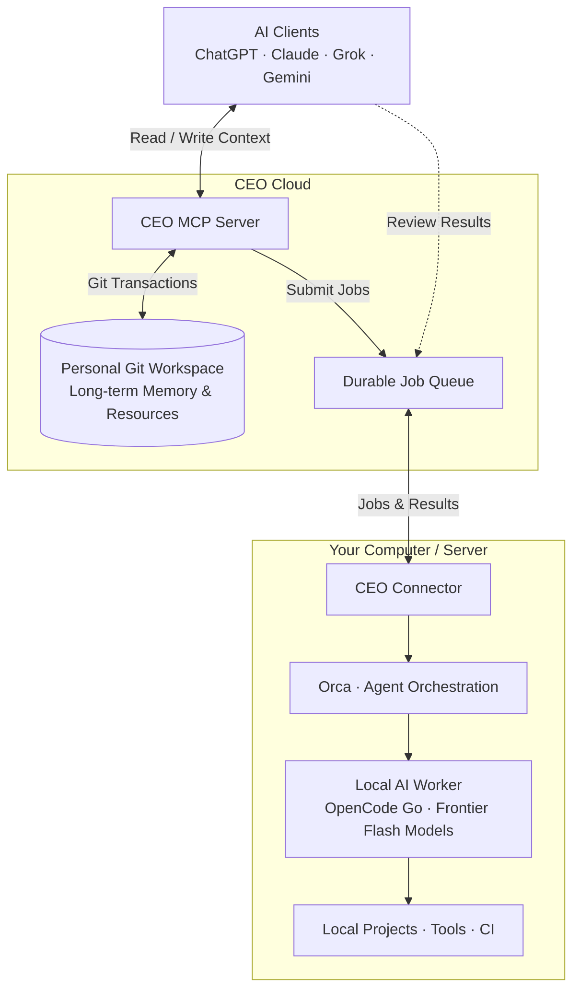

# Chief Everything Officer (CEO)

<p align="center">
  <a href="https://ceo.sentimentalk.com"></a>
  <a href="https://github.com/SentimentalK/chief-everything-officer/releases"></a>
  <a href="https://discord.com/channels/1474581075681349655/1474581076616937497"></a>
  
  <a href="LICENSE"></a>
  
</p>

<p align="center">
  <a href="README.md"><b>English</b></a> | <a href="docs/README.zh-CN.md"><b>简体中文</b></a>
</p>

---

> **Your AI changes. Your context stays.**

Chief Everything Officer (CEO) connects web-based AI assistants directly to your Git-backed personal workspace and dispatches bounded execution tasks safely to your own computer or server.

You can freely self-host the entire infrastructure, or connect instantly using our pre-built, hosted cloud MCP server. Simply authenticate via GitHub to equip web or mobile AI hosts with persistent memory across sessions and real local execution power.

---

## Core Value & Architectural Philosophy

### 1. Hosted Cloud or Self-Hosted: Low Barrier to Long-Term Memory
- **Philosophy & Friction**: Storing text in Markdown and Git is simple; connecting and maintaining the plumbing is not. Furthermore, long-term memory, project status, and historical decisions should never be held hostage by a single proprietary AI platform.
- **CEO Solution**: The stack is completely open-source for full self-hosting. Alternatively, avoid buying VPS instances, configuring domains, and managing daemon processes by using our official ready-to-use cloud MCP server (`https://ceo.sentimentalk.com/mcp/`)—configured in seconds via GitHub OAuth.
- **Value**: Swap models or platforms anytime—your canonical context stays yours forever. Different AI clients share the exact same source of truth, resuming work without background re-explaining.

### 2. Built on Daily Dogfooding, Not a Theoretical Demo
- **Living System**: CEO is not an abstract demo; it is the author's primary daily operating system (eating own dog food).
- **Organic Evolution**: Used around the clock to manage real codebases, curate research materials, draft system architectures, and dispatch local coding agents.
- **Value**: Every mechanism was born out of real-world friction, active debugging, and production edge cases rather than speculative design.

### 3. Master / Worker Architecture: Cloud Reasons, Local Executes
- **Division of Labor**: Web AI provides fluid interaction and premier reasoning; local hardware provides real project files, compilers, private compute, and authorized tools.
- **Web-based Master**: Top-tier frontier flagship models (like GPT-6 Astra, Claude 3.7/4) act as the Master, producing comprehensive technical designs, decomposing tasks, and independently reviewing deliveries.
- **Local Worker**: Coordinated on your workstation via **Orca + OpenCode Go Plan** driving high-efficiency frontier Flash models (such as GLM-5/4 Flash, DeepSeek 4.1 Flash, Gemini 3.8 Flash), executing code edits, running test suites, committing to Git, and passing CI.
- **Value**: The right model for the right job. Web sessions remain clean and focused without manual copy-pasting between browser and terminal.

### 4. $200 Web Sub + OpenCode Go: Slash 95%+ of Token Costs
- **Economic Sustainability**: Not every task demands the most expensive model. Intensive AI engineering must be affordable and sustainable.
- **Real-World Contrast**: In intensive development, the author consumed over **2 Billion (2B) tokens** in a single month. Routing that scale entirely through metered flagship APIs would yield theoretical bills exceeding **$20,000+ USD/month**.
- **CEO Synergy**:
  - A flat web subscription (~**$200/month**, e.g. ChatGPT Pro/Work) handles exhaustive architectural design with unlimited reasoning headroom.
  - A low-cost **OpenCode Go Plan** ($10/month) paired with lightweight Flash models carries out bounded mechanical coding tasks locally.
- **Result**: What would cost tens of thousands in API tokens is compressed into fixed subscriptions around $210/month, slashing overall costs by **over 95%**.

### 5. Remote Dispatch: Drive Local Workstations from Web or Mobile
- **Asynchronous Connectivity**: CEO bridges web and mobile AI clients to your own hardware.
- **Unattended Execution**: Submit a prompt or trigger a job from your phone or browser while away from your desk; your idle home machine or server picks up the task and handles execution automatically.
- **Value**: Computational resources, development environments, and toolchains remain under your full control without being tethered to a physical desk.

### 6. Grounded in Your Private Environment: Completing What Cloud Sandboxes Cannot
- **Connecting Existing Strengths**: CEO avoids reinventing wheels (MCP connects AI, Git preserves data, Orca orchestrates proven tools like OpenCode), letting each layer excel at what it does best.
- **The Last Mile**: Cloud-hosted sandboxes cannot touch your private repositories, dependencies, or local toolchains. Local workers operate natively inside your project tree, run local compilers/linters, and leverage authorized local browser sessions.
- **Value**: CEO does not replace cloud agents—it completes their missing link to the physical machine.

---

## Practical Scenarios

### Scenario 1: Resume Long-Running Projects in Fresh Sessions
When working across weeks or months, technical architecture is already established. In a fresh chat session, the AI automatically retrieves the project's canonical state, decisions, and next tasks via CEO without repeated background re-explaining.

### Scenario 2: Share Canonical Context Across Different AIs
Use ChatGPT for architecture design, Claude for documentation, and other specialized models for research. CEO provides a unified single source of truth (SSOT) across all of them.

### Scenario 3: Drive Local Coding Agents from Web Interfaces
Discuss system design with frontier models in a browser. Once finalized, the Master AI submits a Comprehensive Technical Design as a CEO Job. Local devices run Connector + Orca to coordinate Flash workers (via OpenCode Go), running tests and committing code before web Master review.

### Scenario 4: Turn Idle Hardware and Private Servers into AI Workers
Equip an idle desktop or private cloud server with CEO Connector. It transforms into an autonomous execution worker that compiles code, processes files, and executes tasks in the background without needing you sitting in front of a console.

### Scenario 5: Execute Workflows Requiring Local Environments
Certain operations require access to private repositories, local toolchains, specialized runtimes, or authorized local browser sessions. CEO delegates these tasks to local workers with proper local permissions rather than failing in cloud sandboxes.

### Scenario 6: Run Complex Workflows at a Fraction of API Token Costs
Intensive software iteration can easily consume billions of tokens (2B+). Rather than paying recurring metered API fees for every cycle, CEO pairs a flat monthly web subscription (~$200/month) for heavy reasoning with OpenCode Go ($10/month) and high-efficiency Flash models for local code generation—slashing overall development token expenses by **over 95%**.

---

## Closed-Loop System Architecture



---

## Getting Started

### 1. Connect Web AI via MCP
In any client supporting MCP (ChatGPT, Claude, Cursor, etc.):
1. Add the MCP Server endpoint: `https://ceo.sentimentalk.com/mcp/`
2. Follow the prompt to complete the **OAuth login flow**.
3. Authorize with your **GitHub account** to connect your web AI directly to your personal Git-backed workspace.

### 2. Set Up Local Environment (Orca + CEO Connector)
Local execution is powered by the Orca ADE and the lightweight Rust connector:
1. **Install Orca**: Ensure the [Orca](https://github.com/stablyai/orca) runtime and execution agents (like `opencode`) are installed locally.
2. **Install CEO Connector**: Download and install the prebuilt `ceo-connector` binary for your platform (Linux, macOS, or Windows).

### 3. Device Login & Project Management (CLI Reference)

All persistent device state and configurations reside under: `~/.ceo/connector/` (including `config.json`).

```bash
# 1. Authenticate this device (runs guided setup automatically upon success)
ceo-connector login

# 2. Diagnose local environment, Orca runtime, and configuration health
ceo-connector doctor

# 3. Add an existing Git project to your workspace
# Run inside your project directory (optionally specifying an agent and model override)
ceo-connector project add . --agent opencode --model auto

# 4. Configure project execution agent or model
ceo-connector project set <project-name> --agent opencode --model auto

# 5. Set the workspace default Agent Runtime project
ceo-connector project default-runtime <project-name>

# 6. View configured projects and connector status
ceo-connector project list
ceo-connector status

# 7. Start the background execution daemon (listens for jobs and invokes Orca automatically)
ceo-connector run

# 8. Pause / resume job acquisition
ceo-connector pause
ceo-connector resume
```

---

## Born from Daily Dogfooding

CEO was created to solve real, everyday engineering friction.

The author relies on it around the clock to maintain persistent context, orchestrate real-world repositories, curate research materials, and dispatch coding tasks to local worker pools. Every mechanism has evolved through genuine dogfooding rather than theoretical speculation.

CEO’s ultimate goal is not simply to make AI memorize text, but to **harmonize long-term human context, frontier model reasoning, and private workstation compute into a cohesive, compounding system**.
