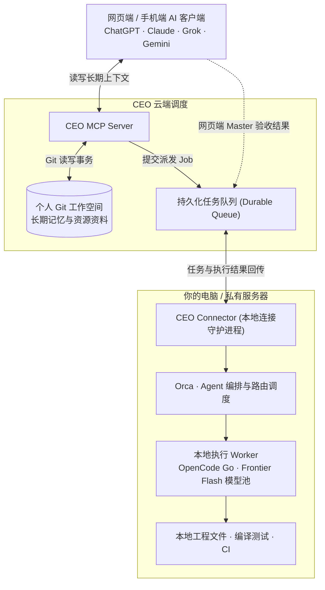

# Chief Everything Officer (CEO)

<p align="center">
  <a href="https://ceo.sentimentalk.com"></a>
  <a href="https://github.com/SentimentalK/chief-everything-officer/releases"></a>
  <a href="https://discord.gg/9KTvW6rSYg"></a>
  
  <a href="../LICENSE"></a>
  
</p>

<p align="center">
  <a href="../README.md"><b>English</b></a> | <a href="README.zh-CN.md"><b>简体中文</b></a>
</p>

---

> **AI 可以换，你的上下文应该留下来。**

Chief Everything Officer (CEO) 将网页端 AI 助手无缝连接到你完全拥有的 Git 长期数据，并在需要落地执行时，把具体任务安全调度给本地电脑或服务器。

你可以自由选择全套私有化部署，也可以直接使用我们开箱即用的云端 MCP 服务。仅需通过 GitHub 授权，即可让任何支持 MCP 的网页/手机 AI 拥有跨会话、跨平台的持久记忆与本地执行力。

---

## 核心设计与价值

### 1. 云端托管或完全私有化：低门槛连接持久记忆，上下文永不丢失
- **哲学与痛点**：把数据存进 Markdown 和 Git 并不稀奇，难点在于连接与运维；同时，长期记忆、项目状态与历史决策不应被锁死在单一闭源 AI 平台中。
- **CEO 方案**：架构完全开源，你可以选择纯私有化部署整套服务；但如果你不想买 VPS、配域名、管进程，也可以直接使用我们官方维护好的云端 MCP 入口（`https://ceo.sentimentalk.com/mcp/`），只需通过 GitHub 授权即可完成初始配置。
- **价值**：AI 可以随时换，你的长期上下文永远归你所有。不同 AI 访问同一份可信底本，开启新会话随时接续旧任务。

### 2. 每天高强度使用的真实产品，而非概念验证
- **真实 Dogfooding**：CEO 不是纸上谈兵的 Demo，而是作者每天深度自用的主力生产力系统。
- **有机演进**：用于跨会话管理真实项目、沉淀资料素材、规划技术设计，并调度本地 Agent 编写真实代码。
- **价值**：系统中的各项机制不是预先臆想的架构，而是在真实生活、长线开发与高强度踩坑中自然生长出来的。

### 3. Master / Worker 架构：云端负责思考，本地负责执行
- **分工哲学**：网页端强 AI 具备便捷交互与顶级推理能力，负责大局；本地环境拥有真实工程文件、工具链与私有算力，负责落地。
- **网页端 Master**：由顶尖 Frontier 旗舰模型（如 GPT-6 Astra、Claude 顶级模型）担任，专注于做极详尽的 **Comprehensive Technical Design**、任务拆解与最终交付验收。
- **本地端 Worker**：由本地电脑上的执行框架（如 **Orca + OpenCode Go Plan** 搭配高性价比 Frontier Flash 模型，如 GLM-4/5 Flash、DeepSeek 4.1 Flash、Gemini 3.8 Flash 等）担任，负责读写本地工程文件、运行单测、提交 Git 并跑通 CI。
- **价值**：合适的事情交给合适的模型，网页端保持干净清爽，彻底告别在终端与浏览器之间反复人工复制粘贴。

### 4. 网页端包月 + OpenCode Go：立省 95%+ 的 Token 账单
- **经济性哲学**：不是所有任务都需要最昂贵的模型。高强度 AI 研发必须在可负担、可持续的成本下运转。
- **真实用量反差**：作者单月密集开发中，网页端 Token 用量达到 **20 亿（2B）Tokens**。若全量走旗舰 API 按量计费，理论账单高达 **$20,000+ 美元/月**。
- **CEO 黄金组合**：
  - 网页端买一个约 **$200/月** 的固定订阅（如 ChatGPT Pro / Work），让顶级 Frontier 模型不限量输出深度架构设计；
  - 本地 Worker 接入极低成本的 **OpenCode Go Plan**（$10/月）调度性价比极高的 Flash 模型进行代码实现与跑测。
- **结果**：以每月两百余美元的固定订阅消化了海量的推理与规划需求，相比纯走 API 路线，**综合研发成本立省 95% 以上**。

### 5. 随时随地跨设备调度家里的算力与私有环境
- **异步调度**：CEO 将移动端/网页端 AI 与你自己的物理设备打通。
- **无人值守**：在手机或工位网页发起任务，家里闲置的 PC 或私有服务器在后台默默上线执行。
- **价值**：计算资源、开发环境与执行工具始终保留在你的完全掌控之中，无需人肉守在电脑前。

### 6. 扎根私有环境：补足纯云端 Agent 触碰不到的边界
- **连接已有生态**：CEO 不重复造轮子（通过 MCP 连 AI，通过 Git 存数据，通过 Orca 编排成熟工具），让各层发挥极致所长。
- **触达最后一公里**：纯云端沙箱无法访问本地私有工程、依赖环境与工具链；本地 Worker 可以直接操作本机工程、运行本地测试，并在明确授权下复用本地浏览器 Session/Cookie 处理需登录内容。
- **价值**：CEO 不是替代云端 Agent，而是为它们补上无法触达的真实本地系统能力。

---

## 典型应用场景

### 场景一：新会话无缝继续长期项目
面对持续数周甚至数月的项目，架构选型与路线已讨论完备。在新开的聊天中，AI 通过 CEO 自动读取最新状态、决策记录与待办任务，无需重复解释背景。

### 场景二：跨不同 AI 共享同一套上下文
习惯用 ChatGPT 做系统架构推导，用 Claude 润色文档，用其他 AI 查阅代码？CEO 为所有主流 AI 提供共享的单一事实底本（SSOT），随时切换工具，工作流始终连续。

### 场景三：从网页端调度本地 AI 编程闭环
在网页端与顶级模型探讨软件设计；方案敲定后，Master AI 生成详尽的 Technical Design 并作为 Job 提交至 CEO 队列。本地设备通过 Connector + Orca 自动调度 Worker（如 OpenCode Go + Flash 模型）修改代码、跑测试、提交 Git 并检查 CI；最后由网页端 Master 自动审查交付物。

### 场景四：让闲置电脑与私有服务器化身 AI Worker
无论是在办公室的工作机、家里的闲置 PC，还是私有云服务器，部署 Connector 后即可充当专属执行节点。手机端随时派发任务，设备在线时自动排队消化，无需人肉守在终端前。

### 场景五：直接访问私有环境与本地工具
本地代码编译、跑单元测试、操作私有文件，或在明确授权下复用本地浏览器的登录状态与 Cookie——这些云端沙箱触及不到的最后一公里能力，CEO 均可安全调度给本地 Worker 处理。

### 场景六：以极低成本支撑海量 AI Token 工作流
高强度研发场景下单月可能消耗数十亿（2B+）Tokens。保留网页端强模型作为 Master（约 $200/月固定包月），将具体编码分配给低成本 Agent（如 OpenCode Go $10/月），避免按量 API 费用爆炸，综合开销立省 95% 以上。

---

## 系统架构与闭环流程



---

## 如何使用

### 第一步：在网页端 AI 中添加 CEO 连接器
在任何支持 MCP 的客户端（如 ChatGPT、Claude、Cursor 等）：
1. 添加 MCP Server 地址：`https://ceo.sentimentalk.com/mcp/`
2. 点击连接后会自动跳转至 **OAuth 授权登录** 页面。
3. 选择 **GitHub 登录** 并完成授权，你的网页端 AI 即可立即连接上属于你的 Git 长期工作空间。

### 第二步：配置本地环境（基于 Orca 与 CEO Connector）
本地执行完全依托于 Orca ADE 与轻量 Rust Connector：
1. **安装 Orca**：确保本地已安装 [Orca](https://github.com/stablyai/orca) 运行时及执行代理（如 `opencode`）。
2. **安装 CEO Connector**：下载并安装对应平台的 `ceo-connector` 二进制（支持 Linux、macOS、Windows）。

### 第三步：设备登录与项目管理（常用命令）

本地 Connector 产生的所有持久化配置与凭据默认存放在：`~/.ceo/connector/`（含 `config.json` 等）。

```bash
# 1. 登录当前设备（首次必须先登录，登录成功后会自动触发 setup 引导配置）
ceo-connector login

# 2. 诊断本地环境、Orca 运行时与配置是否就绪
ceo-connector doctor

# 3. 添加本地 Git 项目到 CEO 工作区
# 在项目目录下直接执行（可指定绑定的 Agent 如 opencode，以及所使用的模型）
ceo-connector project add . --agent opencode --model auto

# 4. 设置项目的执行 Agent 或模型
ceo-connector project set <project-name> --agent opencode --model auto

# 5. 设置工作区的默认运行时项目（Default Agent Runtime）
ceo-connector project default-runtime <project-name>

# 6. 查看项目列表与当前状态
ceo-connector project list
ceo-connector status

# 7. 启动本地执行守护进程（开始在后台监听任务并自动调度 Orca 执行）
ceo-connector run

# 8. 暂停 / 恢复任务拉取
ceo-connector pause
ceo-connector resume
```

### 私有化部署示例 (Self-Hosting Example)

如果你倾向于完全掌控服务端基础设施（托管个人 MCP 服务与任务调度后端），可以参考官方的 Kubernetes / K3s 生产部署示例：

- 完整部署清单与配置参考：[k3s-homelab/apps/ceo](https://github.com/SentimentalK/k3s-homelab/tree/master/apps/ceo)

在私有化部署环境下，本地 `ceo-connector` 登录时需通过 `--server` 参数指定你的私有服务端地址：
```bash
ceo-connector login --server https://ceo.your-domain.com
```

---

## 来自真实使用

CEO 最初诞生于解决开发者自己的真实痛点。

作者每天深度将其作为主力系统（Eating own dog food）：维护长期跨会话上下文、管理复杂研发项目、沉淀资料素材，并通过网页端 AI 调度本地多 Agent 协同工作。各项机制均在真实业务代码的打磨与边缘场景的试错中持续演进。

CEO 的终极追求不是让 AI 记住更多文本片段，而是让**个人长期上下文、前沿大模型的推理规划与用户本机的计算资源能够真正高效协同**。
